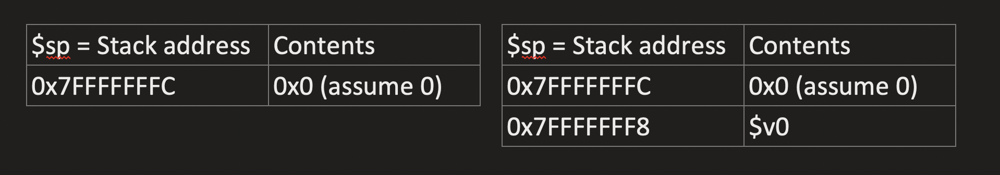

# Written Assignment Lab 4

1. Consider the following section of C code:

```c
int my_global = 100;
main(){
    int z;
    my_global += 1;
    z = leaf_function(int x);
}
int leaf_function(int x){
    return x + 1;
}
```

a. convert to mips assembly

```bash
#--------------------------
#Assingment 4 question 1 written
#cosc211, stuid 51940633
#--------------------------
    .text
    .globl main
main:
    addi    $s0, $zero, 100 #intialize my_global
    addi    $s0, $s0, 1     #increment my_global
    addi    $s1, $zero, 0   #init z.
    jal     leaf_function   #call leaf_function
    lw      $s1, 0($sp)     #store the return value in z
    addi    $sp, $sp, 4
    j       exit
leaf_function:
    # accepts x as an argument
    addi    $sp, $sp, -20
    sw      $ra, 0($sp)
    sw      $a0, 4($sp)
    sw      $s0, 8($sp)
    sw      $s1, 12($sp)
    sw      $v0, 16($sp)
    #store x in $s1
    addi    $s1, $a0, 0
    #store x+1 in $v0
    #store the return value in z
    addi    $v0, $s1, 1
    sw      $v0, 16($sp)
    lw      $s1, 12($sp)
    lw      $s0, 8($sp)
    lw      $a0, 4($sp)
    lw      $ra, 0($sp)
    addi    $sp, $sp, 16
    jr      $ra
exit:
    addi $v0, $0, 10
    syscall
```

b. show contents of stack before and after the procedure call (start at `$sp = 0x7ffffffc`)

- This is before and after respectively.



c. same as a but u can use temp reg

```bash
#--------------------------
#Assingment 4 question 1 written
#cosc211, stuid 51940633
#--------------------------
    .text
    .globl main
main:
    addi $t0, $zero, 100 #intialize my_global
    addi $t0, $s0, 1 #increment my_global
    #init z.
    addi $t1, $zero, 0
    #call leaf_function
    jal leaf_function
    #store the return value in z
    addi $t1, $v0, 0
    j exit
leaf_function:
    # accepts x as an argument $a0
    addi $sp, $sp, -8
    sw $ra, 0($sp)
    sw $a0, 4($sp)
    #store x in $s1
    addi $t2, $a0, 0
    #store x+1 in $v0
    addi $v0, $t2, 1
    #restore
    lw $a0, 4($sp)
    lw $ra, 0($sp)
    addi $sp, $sp, 8
    jr $ra
exit:
    addi $v0, $0, 10
    syscall
```

2. Translate the following strings into hexadecimal ASCII byte values:

a. (1 mark) hello word

- `0x68 0x65 0x6F 0x6F 0x6F 0x20 0x77 0x6F 0x72 0x64`

b. (1 mark) 0123456789

- `0x30 0x31 0x32 0x33 0x34 0x35 0x36 0x37 0x38 0x39`
