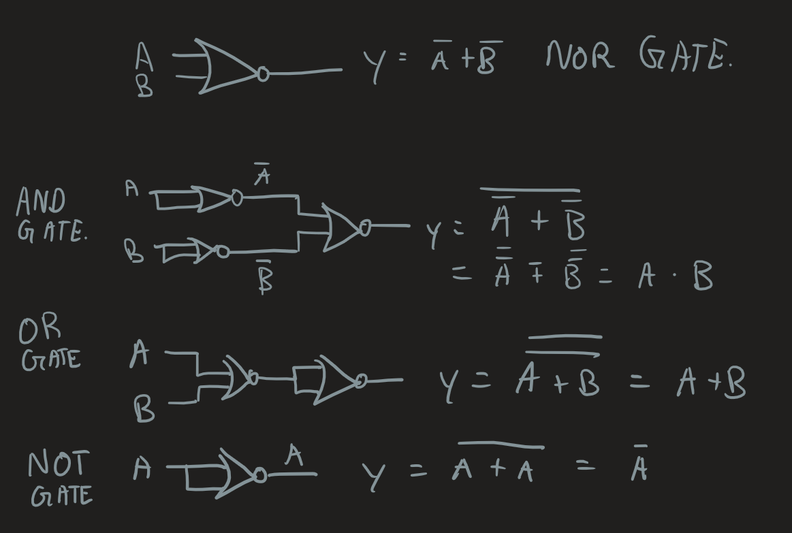

# Written Assignment

## Note: It is reccomended that you open in [markdown viewer](https://upmath.me/) to see this document properly, as it contains KaTeX equations

1. (/8) Exercises (from 5th edition)

    a. 3.6 [5] <§3.2> Assume 185 and 122 are unsigned 8-bit decimal integers. Calculate 185 – 122. Is there overflow, underflow, or neither?

    + 185 = `10111001`
    + 122 = `01111010`
    + $$185 - 122$$
    + = `00111111` = 63
    + There are no overflow or underflow. This is because the result is within the range of 8-bit unsigned integer, which is 0 to 255.

    b. 3.20 [5] <§3.5> What decimal number does the bit pattern `0×0C000000` represent if it is a two’s complement integer? An unsigned integer?
    + The bit pattern 0x0C000000 represents the binary number `0000 1100 0000 0000 0000 0000 0000 0000`
    + which is 12*16^7 = 201326592 in decimal for two's complement integer
    + The value in decimal number is the same for unsigned integer as well.

    c. 3.21 [10] <§3.5> If the bit pattern 0×0C000000 is placed into the Instruction Register, what MIPS instruction will be executed?
    + opcode = `0000 11`
    + address = `00 0000 0000 0000 0000 0000 0000`
    + the instruction is `jal $0`

    d. 3.22 [10] <§3.5> What decimal number does the bit pattern 0×0C000000 represent if it is a floating point number? Use the IEEE 754 standard.
    + The bit pattern 0x0C000000 represents the binary number `0000 1100 0000 0000 0000 0000 0000 0000` for floating point number
    + First bit is sign bit, which is 0, so the number is positive
    + The next 8 bits are exponent bits, which is `0000 1100` = $$1 \times 2^{3} + 1 \times 2^{2} = 12$$
    + The last 23 bits are fraction bits, which is `0000 0000 0000 0000 0000 0000` = 0
    + The formula is $$(-1)^s \times (1 + \text{Fraction}) \times 2^{(\text{Exponent} - \text{Bias})}$$
    + The value in decimal number is $$(-1)^0 \times (1 + 0) \times 2^{(12 - 127)} = 2^{-115}$$

    e. 3.23 [10] <§3.5> Write down the binary representation of the decimal number 63.25 assuming the IEEE 754 single precision format.
    + $$63.25 = 63 + 0.25$$
    + 63 = `0011 1111`
    + 0.25 = `0.01`
    + The binary representation of the decimal number 63.25 is `00111111.01`
    + Convert to IEEE 754 single precision format:
    + Normalized form: `1.1111101 * 2^5`
    + Sign bit is 0, so the number is positive
    + Exponent bits is `5 + 127 = 132 = 1000 0100`
    + Fraction bits is `1111 1010 0000 0000 0000 000`
    + The binary representation of the decimal number 63.25 in IEEE 754 single precision format is `0 10000100 11111010000000000000000`

2. (/8) For the following binary fraction, write the IEEE 754 single floating-point representation of the number

    a. (4 marks) 111111.012
    + Normalized form: `1.1111101 * 2^5`
    + Sign bit is 1, so the number is negative
    + Exponent bits is `5 + 127 = 132 = 1000 0100`
    + Fraction bits is `1111 1010 0000 0000 0000 000`
    + The binary representation of the decimal number 63.25 in IEEE 754 single precision format is `1 10000100 11111010000000000000000`

    b. (4 marks) 100011111000101011.011012
    + Normalized form is `1.0001111100010101101101 * 2^17`
    + Sign bit is 1, so the number is negative
    + Exponent bits is `17 + 127 = 144 = 1001 0000`
    + Fraction bits is `0001 1111 0001 0101 1011 010`
    + The binary representation of the decimal number 63.25 in IEEE 754 single precision format is `1 10010000 00011111000101011011010`

3. (/10) Prove that the NOR gate is universal by showing how to build the AND, OR, and NOT functions using a two-input NOR gate. You are to use only NOR gates to implement the functionality of the other functions. (review B.1, B.2)

    

4. 
