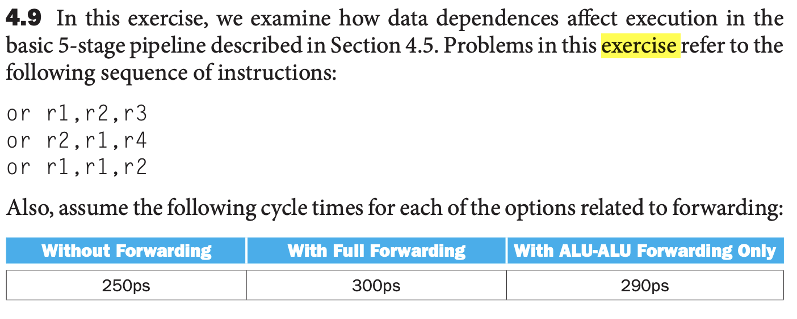
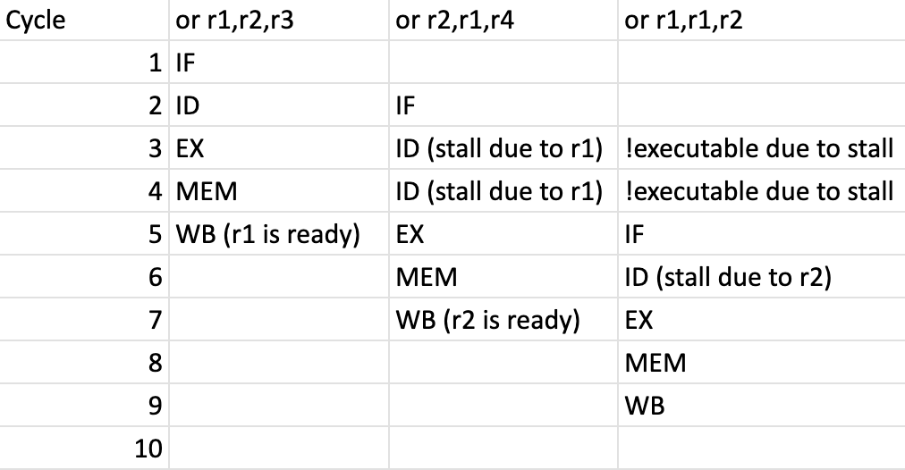

# Written Assignment

1. (/6) Exercise 4.9

   

   a. 4.9.1 (4 marks) [10] <§4.5> Indicate dependences and their type.

   - Dependence: Instruction 2: r1 in second instruction as it is waiting for the first instruction to write to r1
     - Type: true-dependency (RAW, Read-After-Write)
   - Dependence: Instruction 3: r1 and r2 are both waiting for the first instruction to write to r1 and r2 to be written in second instruction
     - Type: true-dependency (RAW, Read-After-Write)

   b. 4.9.2 (2 marks)[10] <§4.5> Assume there is no forwarding in this pipelined processor. Indicate hazards and add nop instructions to eliminate them.

   - Without forwarding, the hazards are:
     - RAW (Read-After-Write): r1 in second instruction is waiting for the first instruction to write to r1
     - RAW (Read-After-Write): r1 and r2 are both waiting for the first instruction to write to r1 and r2 to be written in second instruction

   

To eliminate the hazards, we need to:

```bash
   or r1, r2, r3
   nop
   nop
   or r2, r1, r4
   nop
   or r1, r1, r2
```
