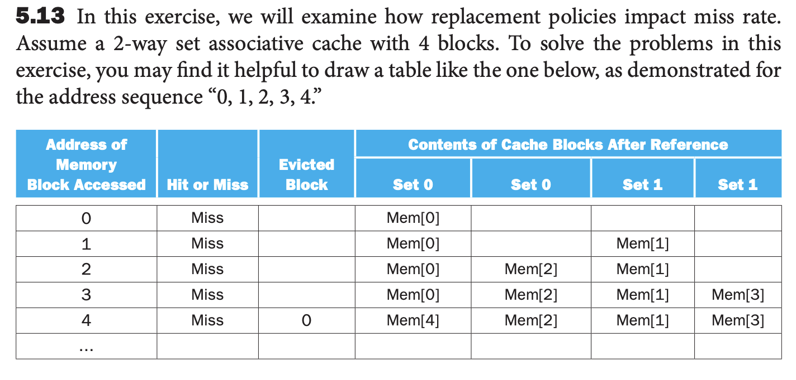

# Written Assignment

1. 5.2 Caches are important to providing a high-performance memory hierarchy to processors. Below is a list of 32-bit memory address references, given as word addresses:

   3, 180, 43, 2, 191, 88, 190, 14, 181, 44, 186, 253

- 5.2.1 [10] <§5.3> For each of these references, identify the binary address, the tag, and the index given a direct-mapped cache with 16 one-word blocks . Also list if each reference is a hit or a miss, assuming the cache is initially empty.

  - With 16 one-word blocks, we have 16 cache block. We need 4 bits to represent the index (2^4 = 16). The remaining bits will be used for the tag and the block offset.

  | word addy | binary addy | tag  | index     | hit/miss |
  | --------- | ----------- | ---- | --------- | -------- |
  | 3         | 00000011    | 0000 | 0011 = 3  | miss     |
  | 180       | 10110100    | 1011 | 0100 = 4  | miss     |
  | 43        | 00101011    | 0010 | 1011 = 11 | miss     |
  | 2         | 00000010    | 0000 | 0010 = 2  | miss     |
  | 191       | 10111111    | 1011 | 1111 = 15 | miss     |
  | 88        | 01011000    | 0101 | 1000 = 8  | miss     |
  | 190       | 10111110    | 1011 | 1110 = 14 | miss     |
  | 14        | 00001110    | 0000 | 1110 = 14 | miss     |
  | 181       | 10110101    | 1011 | 0101 = 5  | miss     |
  | 44        | 00101100    | 0010 | 1100 = 12 | miss     |
  | 186       | 10111010    | 1011 | 1010 = 10 | miss     |
  | 253       | 11111101    | 1111 | 1101 = 13 | miss     |

- 5.2.2 [10] <§5.3> For each of these references, identify the binary address, the tag, and the index given a direct-mapped cache with two-word blocks and a total size of 8 blocks. Also list if each reference is a hit or a miss, assuming the cache is initially empty.

  - With two-word blocks and a total size of 8 blocks, 2^3 = 8, we need 3 bits to represent the index. The remaining bits will be used for the tag and the block offset.

  | word addy | binary addy | tag  | index | offset | hit/miss |
  | --------- | ----------- | ---- | ----- | ------ | -------- |
  | 3         | 00000011    | 0000 | 001   | 1      | miss     |
  | 180       | 10110100    | 1011 | 010   | 0      | miss     |
  | 43        | 00101011    | 0010 | 101   | 1      | miss     |
  | 2         | 00000010    | 0000 | 001   | 0      | hit      |
  | 191       | 10111111    | 1011 | 111   | 1      | miss     |
  | 88        | 01011000    | 0101 | 100   | 0      | miss     |
  | 190       | 10111110    | 1011 | 111   | 0      | hit      |
  | 14        | 00001110    | 0000 | 111   | 0      | miss     |
  | 181       | 10110101    | 1011 | 010   | 1      | hit      |
  | 44        | 00101100    | 0010 | 110   | 0      | miss     |
  | 186       | 10111010    | 1011 | 101   | 0      | miss     |
  | 253       | 11111101    | 1111 | 110   | 1      | miss     |

---

2. 5.3 For a direct-mapped cache design with a 32-bit address, the following bits of the address are used to access the cache:

   | tag   | index | offset |
   | ----- | ----- | ------ |
   | 31-10 | 9-5   | 4-0    |

- 5.3.1 [5] <§5.3> What is the cache block size (in words)?

  $$2^5 = 32 \space words$$

- 5.3.2 [5] <§5.3> How many entries does the cache have?

  $$2^5 = 32 \space entries$$

- 5.3.3 [5] <§5.3> What is the ratio between total bits required for such a cache implementation over the data storage bits?

  $$32 \times 32 = 1024$$

---

3. 5.6 In this exercise, we will look at the diff erent ways capacity aff ects overall performance. In general, cache access time is proportional to capacity. Assume that main memory accesses take 70 ns and that memory accesses are 36% of all instructions. The following table shows data for L1 caches attached to each of two processors, P1 and P2

   |     | L1 Size | L1 Miss Rate | L1 Hit Time |
   | --- | ------- | ------------ | ----------- |
   | P1  | 2 KiB   | 8.0%         | 0.66 ns     |
   | P2  | 4 KiB   | 6.0%         | 0.90 ns     |

- 5.6.1 [5] <§5.4> Assuming that the L1 hit time determines the cycle times for P1 and P2, what are their respective clock rates?

  $$Clock \space rate / Clock \space speed = \frac{1}{Cycle \space time \space (Hit \space time)}$$

  $$P1_{clock \space rate} = \frac{1}{0.66} = 1.5 \space GHz$$

  $$P2_{clock \space rate} = \frac{1}{0.90} = 1.1 \space GHz$$

- 5.6.2 [5] <§5.4> What is the Average Memory Access Time for P1 and P2?

  $$Miss \space penalty = Miss \space time - Hit \space time$$

  $$P1_{miss \space penalty} = 70 - 0.66 = 69.34 \space ns$$

  $$P2_{miss \space penalty} = 70 - 0.90 = 69.10 \space ns$$

  $$AMAT = Hit \space time + (Miss \space rate \times Miss \space penalty) $$

  $$P1_{AMAT} = 0.66 + (0.08 \times 70 )= 6.26 \space ns $$

  $$P2_{AMAT} = 0.90 + (0.06 \times 70) = 4.50 \space ns $$

- 5.6.3 [5] <§5.4> Assuming a base CPI of 1.0 without any memory stalls, what is the total CPI for P1 and P2? Which processor is faster?

  $$Cycle \space Per \space Instruction = Base \space CPI + (Miss \space rate \times Miss \space penalty)$$

  $$P1_{CPI} = 1 + (0.36 \times 6.26) = 3.25$$

  $$P2_{CPI} = 1 + (0.36 \times 4.50) = 2.62$$

  - P2 is faster, because it has lower CPI.

---

4. 

5.13 In this exercise, we will examine how replacement policies impact miss rate. Assume a 2-way set associative cache with 4 blocks. To solve the problems in this exercise, you may find it helpful to draw a table like the one below, as demonstrated for the address sequence "0, 1, 2, 3, 4."

| Address | Hit/Miss | Evicted block | set 0  | set 0  | set 1  | set 1  |
| ------- | -------- | ------------- | ------ | ------ | ------ | ------ |
| 0       | miss     |               | Mem[0] |        |        |        |
| 1       | miss     |               | Mem[0] |        | Mem[1] |        |
| 2       | miss     |               | Mem[0] | Mem[2] | Mem[1] |        |
| 3       | miss     |               | Mem[0] | Mem[2] | Mem[1] | Mem[3] |
| 4       | miss     | 0             | Mem[4] | Mem[2] | Mem[1] | Mem[3] |

Consider the following address sequence: 0, 2, 4, 8, 10, 12, 14, 16, 0

- 5.13.1 [5] <§§5.4, 5.8> Assuming an LRU replacement policy, how many hits does this address sequence exhibit?

  - 5 hits

- 5.13.2 [5] <§§5.4, 5.8> Assuming an MRU (most recently used) replacement policy, how many hits does this address sequence exhibit?

- 5.13.3 [5] <§§5.4, 5.8> Simulate a random replacement policy by fl ipping a coin. For example, “heads” means to evict the fi rst block in a set and “tails” means to evict the second block in a set. How many hits does this address sequence exhibit?

5. Given a hard disk with 512 byte sector, an 8 ms (millisecond) average seek time, a 100 Mbyte/second data (megabytes per second) transfer rate, a controller overhead of 2 ms and a rotational speed of 10,000 rpm, calculate the following. Show all calculations.

   a. The rotational latency. (2 marks) (show all work)

   b. The transfer time for one sector. (2 marks) (show all work)

   c. The average read time (recall that this is the average seek time + average rotational latency + sector transfer time + controller overhead) (2 marks) (show all work)
